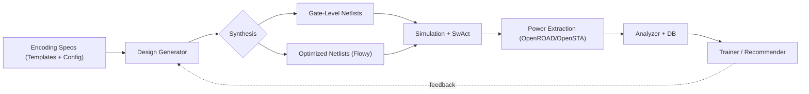
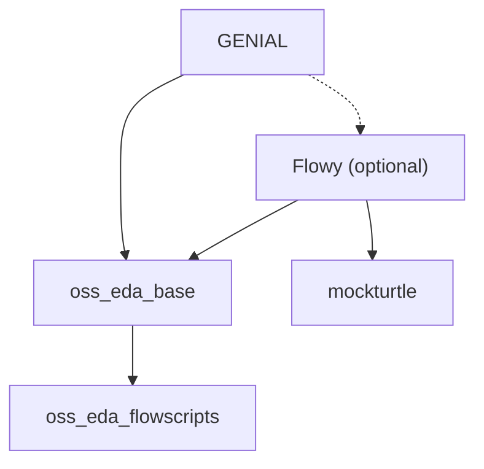

<div align="center">

# GENIAL — Design Generation From Encodings

[](pyproject.toml)
[](LICENSE)
[](.devcontainer/docker/Dockerfile)
[](tests)

</div>

**GENIAL** is a research toolkit for exploring how *signal encodings* impact hardware characteristics such as switching activity, area, and power. It automates the full exploration loop:

- 🧬 Generate combinational designs from encoding specs
- ⚙️ Synthesize with Yosys/ABC or Flowy pipelines
- 📉 Simulate and collect switching activity
- 🔋 Extract power using OpenROAD/OpenSTA
- 📊 Analyze results and train encoding recommenders

> 🔬 GENIAL supports the GENIAL study on generative encoding for low-activity logic.  
> 📖 If you use GENIAL in academic work, please cite:
>
> [GENIAL: Generative Design Space Exploration via Network Inversion for Low Power Algorithmic Logic Units (arXiv:2507.18989)](https://arxiv.org/abs/2507.18989)


## 🏁 Table of Content
- [GENIAL — Design Generation From Encodings](#genial--design-generation-from-encodings)
  - [🔍 Overview](#-overview)
  - [⚙️ Pipeline](#️-pipeline)
  - [✨ Key Features](#-key-features)
  - [🚀 Quick Start](#-quick-start)
    - [0. Clone the repo with submodules](#0-clone-the-repo-with-submodules)
    - [1. Configure environment](#1-configure-environment)
    - [2. Set up Python environment with `uv`](#2-set-up-python-environment-with-uv)
    - [3. Install GENIAL as a package](#3-install-genial-as-a-package)
    - [4. Build Docker images](#4-build-docker-images)
    - [5. (Optional) Enable pre-commit hooks](#5-optional-enable-pre-commit-hooks)
  - [🧪 Examples](#-examples)
    - [Generate 1 design (no synthesis/simulation):](#generate-1-design-no-synthesissimulation)
    - [Run a minimal end‑to‑end loop (debug mode):](#run-a-minimal-endtoend-loop-debug-mode)
  - [🗂️ Repository Structure](#️-repository-structure)
  - [📚 Detailed Setup Documentation](#-detailed-setup-documentation)
  - [📚 Usage Documentation](#-usage-documentation)
  - [📖 Citation](#-citation)
  - [🙏 Acknowledgements](#-acknowledgements)
  - [Interdependency Graph](#interdependency-graph)
  - [🤝 Contributing](#-contributing)
  - [⚖️ License](#️-license)

---

## 🔍 Overview

- **Design families:** Adders, multipliers, encoders, decoders, FSMs
- **Encoding schemes:** Two’s complement, unsigned, mixed, one-hot, permuted, etc.
- **Backends:** Yosys, Mockturtle, ABC, Verilator/Cocotb, OpenROAD/OpenSTA
- **Extra:** Flowy (optional) for advanced logic synthesis
- **Toolkit features:** Experiment templating, batching, tracking, analysis, and model training

---

## ⚙️ Pipeline



---

## ✨ Key Features

* 🧪 **Modular experiment templates** – Configurable by design family, encoding scheme, toolchain
* ⚡ **Parallelized runners** – For synthesis, simulation (SwAct), power extraction
* 🔁 **Efficient state tracking** – Resume, skip, or re-run steps as needed
* 🤖 **Analysis and ML-ready** – Rich output database, training hooks for recommender models

---

## 🚀 Quick Start

### 0. Clone the repo with submodules

```bash
<!-- git clone --recursive https://github.com/<org>/genial.git -->
git@ssh.gitlab.huaweirc.ch:zrc-von-neumann-lab/cstt-mmac/oss-eda-package/genial.git
# Or initialize submodules manually:
git submodule update --init --recursive
```

### 1. Configure environment

Copy and edit your `.env`:

```bash
cp .env.template .env
# Then edit: set SRC_DIR, WORK_DIR, GL_TOKEN
```


### 2. Set up Python environment with [`uv`](https://astral.sh/uv/)

```bash
curl -LsSf https://astral.sh/uv/install.sh | sh
source $HOME/.local/bin/env
uv venv --python 3.13 envs/313_genial
source envs/313_genial/bin/activate
```

If it's the first time you install uv, you'll have to restart your shell.

### 3. Install GENIAL as a package

```bash
# [Optional] for fresh ubuntu installs:
# sudo apt-get update
# sudo apt-get install -y build-essential gcc g++ make
uv pip install -e .
```

### 4. Build Docker images

This will take a while.
While it's running, you can read this repository documentation further.
We recommend reading it in the order suggested as in the [usage documentation](#-usage-documentation) section.

You can also read the [GENIAL paper](https://arxiv.org/abs/2507.18989) to get a better idea of what this repository will enable you to do.

```bash
./.devcontainer/docker/build_dockers.sh --build-base
```

### 5. (Optional) Enable pre-commit hooks

```bash
pre-commit install
```

📄 See [docs/setup.md](docs/setup.md) for additional instructions.

---

## 🧪 Examples

### Generate 1 design (no synthesis/simulation):

```bash
python -m genial.experiment.task_launcher \
  --experiment_name multiplier_2bi_4bo_permuti_allcells_notech_fullsweep_only \
  --output_dir_name demo \
  --only_gener --nb_new_designs 1
```

### Run a minimal end‑to‑end loop (debug mode):

```bash
python -m genial.experiment.task_launcher \
  --experiment_name multiplier_2bi_4bo_permuti_allcells_notech_fullsweep_only \
  --output_dir_name demo_run \
  --debug --nb_workers 1
```

---

## 🗂️ Repository Structure

| Path                                                  | Description                                             |
| ----------------------------------------------------- | ------------------------------------------------------- |
| `src/genial/`                              | Core logic: generator, launcher, analyzer, ML training  |
| `src/genial/templates_and_launch_scripts/` | Experiment templates and launch scripts                 |
| `scripts/`                                            | Ad-hoc loop helpers and automation scripts              |
| `tests/`                                              | Unit tests, fixtures, and CI-related testing            |
| `docs/`                                               | Setup guides, architecture explanations, usage examples |

---

## 📚 Detailed Setup Documentation

* [Setup](docs/setup.md)

## 📚 Usage Documentation

* [Launcher](docs/launcher.md)
* [Analyzer](docs/analyzer.md)
* [Training](docs/training.md)
* [Recommender / Network Inversion](docs/recommender.md)
* [Loop Execution](docs/loop.md)
* [Utility Scripts](docs/scripts.md)
* [Switching Activity Model](docs/switching_activity.md)

---

## 📖 Citation

```
@inproceedings{genial2026,
  author    = {Maxence Bouvier and Ryan Amaudruz and Felix Arnold and Renzo Andri and Lukas Cavigelli},
  title     = {{GENIAL}: Generative Design Space Exploration via Network Inversion for Low Power Algorithmic Logic Units},
  booktitle = {Proceedings of the 31st Asia and South Pacific Design Automation Conference (ASPDAC)},
  year      = {2026},
  note      = {To appear},
  url       = {https://arxiv.org/abs/2507.18989}
}
```

---

## 🙏 Acknowledgements

GENIAL builds upon a vibrant open-source ecosystem, all licenses and copyright notices have been kept intact:

* 🧠 [Yosys](https://yosyshq.net/yosys/) – Logic synthesis
* 🔧 [ABC](https://people.eecs.berkeley.edu/~alanmi/abc/) – Logic optimization
* 🕸️ [Mockturtle](https://github.com/lsils/mockturtle) – MIG-based Logic optimization
* 🏗️ [OpenROAD](https://theopenroadproject.org/), [OpenSTA](https://github.com/The-OpenROAD-Project/OpenSTA) – PnR and STA
* 🔍 [Verilator](https://www.veripool.org/verilator/), [Cocotb](https://www.cocotb.org/) – Simulation
* 🧮 [PyTorch](https://pytorch.org/), [Pytorch Lightning](https://lightning.ai/docs/pytorch/stable/) – Surrogate model training
* 📚 [SOAP](https://github.com/nikhilvyas/SOAP), [LAMB](https://huggingface.co/spaces/Roll20/pet_score/blob/9e46325ff5d82df348bad5b4a235eac8410959b8/lib/timm/optim/lamb.py)

---

## 🎡 Interdependency Graph
The following graph shows the dependencies between the different repositories used for running the full flow.

➡️ **Note:** The `flowy` branch is optional but *highly recommended* for obtaining the best results.



## 🤝 Contributing

We welcome contributions of all kinds! To get started:

* **Environment:** Use Python 3.13 with [`uv`](https://astral.sh/uv/). Install the repo in editable mode with dev dependencies using:
  `uv pip install -e .`
* **Pre-commit:** Install hooks with `pre-commit install` to enable automatic linting and formatting (via `ruff`).
* **Tests:** Add or modify tests under `tests/`. Prefer fast, hermetic tests. For heavy flows (e.g. Docker-based), mark them appropriately and skip if Docker is unavailable (see `tests/conftest.py`).
* **Branching & PRs:** Work in a feature branch. Keep changes focused, write clear commit messages, and include a short rationale and any user-facing changes in your PR description.
* **Docs:** Update `README.md` and relevant `docs/` files if your contribution changes usage, behavior, or setup.

For larger features or architectural changes, please open an issue first to discuss scope and design.

See [docs/developer/contributing.md](docs/developer/contributing.md) for full contribution guidelines.

---
